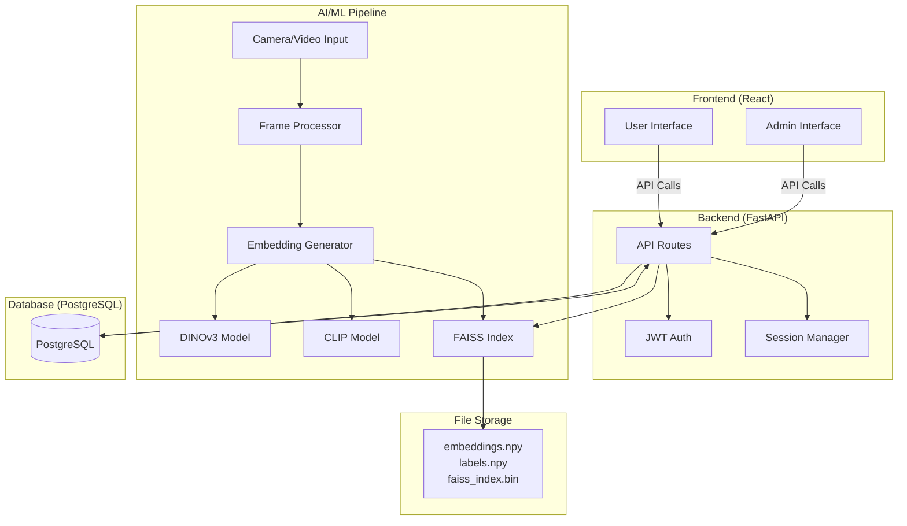
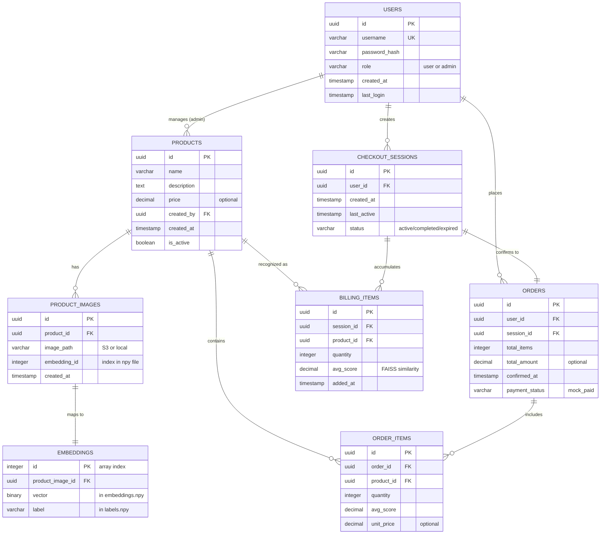
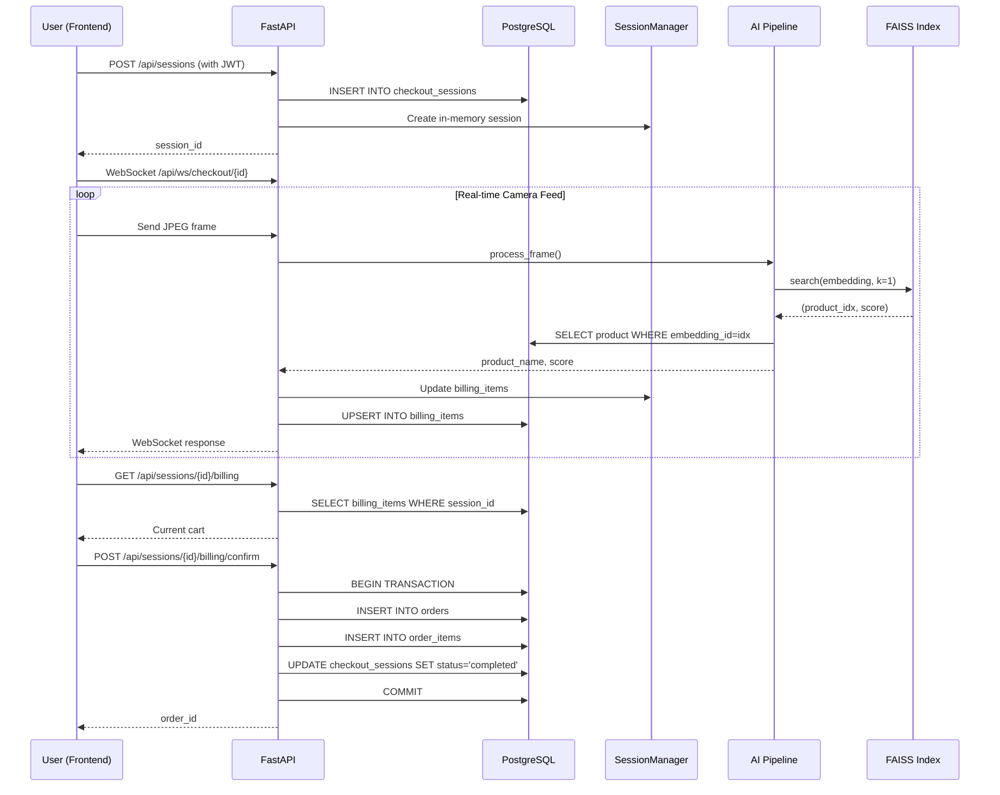
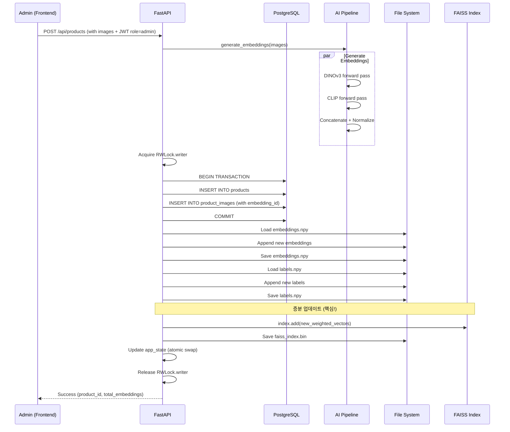
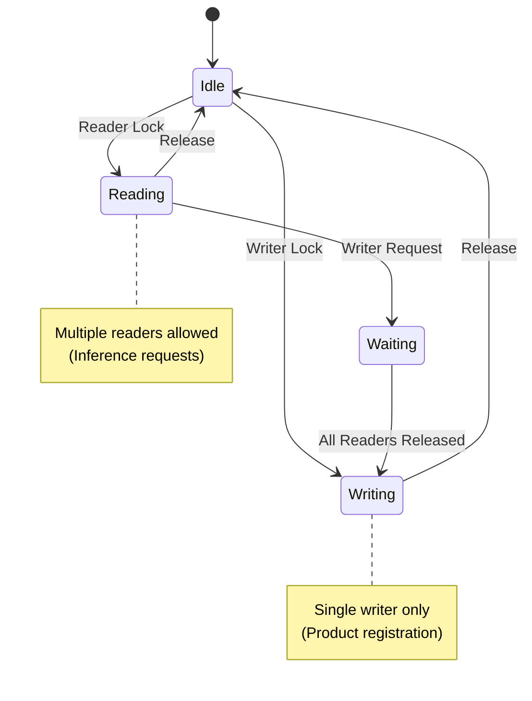

# EBRCS Streaming Database ERD

## 전체 시스템 아키텍처



## Entity-Relationship Diagram



## 데이터 플로우 다이어그램

### 1. 사용자 체크아웃 플로우



### 2. 관리자 상품 등록 플로우 (증분 업데이트)



### 3. 마이페이지 주문 내역 조회

```mermaid
sequenceDiagram
    participant U as User (Frontend)
    participant API as FastAPI
    participant DB as PostgreSQL

    U->>API: GET /api/orders (with JWT)
    API->>DB: SELECT orders WHERE user_id = jwt.user_id
    API->>DB: JOIN order_items ON orders.id
    API->>DB: JOIN products ON order_items.product_id
    DB-->>API: Order history with details
    API-->>U: [
        {
          order_id, confirmed_at, total_items,
          items: [{product_name, quantity, score}, ...]
        },
        ...
      ]
```

## 임베딩 파일 구조

```mermaid
graph LR
    subgraph "File System"
        E[embeddings.npy<br/>shape: (N, 1280)<br/>DINO 1024 + CLIP 256]
        L[labels.npy<br/>shape: (N,)<br/>product names]
        F[faiss_index.bin<br/>IndexFlatIP<br/>dimension: 1280]
    end

    subgraph "Database Mapping"
        PI[product_images<br/>embedding_id = row index]
    end

    E -.row index.-> PI
    L -.row index.-> PI
    F -.search result idx.-> PI
```

## 증분 업데이트 메커니즘

```mermaid
flowchart TD
    START[New Product Upload] --> GEN[Generate Embeddings<br/>DINOv3 + CLIP]
    GEN --> LOCK[Acquire RWLock Writer]

    LOCK --> LOAD[Load Existing<br/>embeddings.npy<br/>labels.npy]

    LOAD --> APPEND[Append New Data<br/>old_emb + new_emb<br/>old_lbl + new_lbl]

    APPEND --> SAVE[Save Updated Files<br/>embeddings.npy<br/>labels.npy]

    SAVE --> INCR{Incremental<br/>Update?}

    INCR -->|YES ⭐| ADD[index.add(new_weighted)<br/>O 1 Complexity]
    INCR -->|NO ❌| REBUILD[Rebuild Full Index<br/>O n Complexity]

    ADD --> PERSIST[faiss.write_index<br/>faiss_index.bin]
    REBUILD --> PERSIST

    PERSIST --> SWAP[Atomic Swap<br/>app_state.faiss_index<br/>app_state.labels]

    SWAP --> UNLOCK[Release RWLock]
    UNLOCK --> END[Return Success]

    style ADD fill:#90EE90
    style REBUILD fill:#FFB6C6
    style INCR fill:#FFD700
```

## 동시성 제어



---

## SQL 마이그레이션 스크립트

위 ERD를 구현하는 실제 SQL은 다음 파일에서 확인:
- `backend/migrations/001_init_schema.sql`

## 시각화 방법

이 파일은 Mermaid 다이어그램을 포함하고 있습니다:
- **GitHub/GitLab**: 자동 렌더링
- **VSCode**: Mermaid Preview 확장 설치
- **온라인**: https://mermaid.live 에서 코드 복사/붙여넣기
